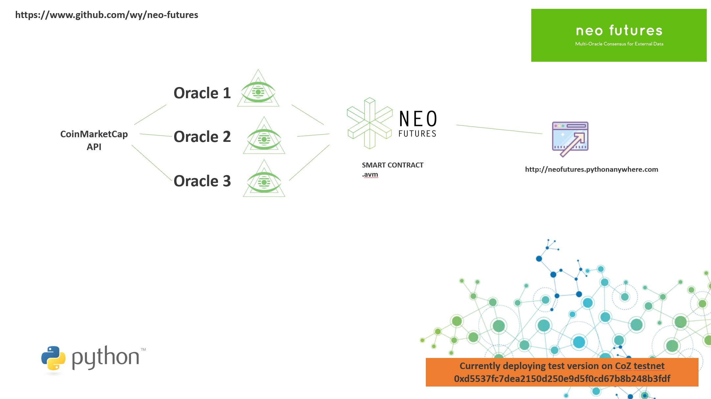

# neo-futures
Multi-Oracle Implementation for Neo Blockchain (Submitted for CoZ dApps #2 Challenge). Find out more about [City of Zion](https://cityofzion.io/).


## Introduction to Oracles
Oracles is a term used in the context of Blockchain Technologies to refer to systems or services that can provide external data (that originates outside of the Blockchain) and input it into the Blockchain so it can be accessed by Smart Contracts and other services on the Blockchain.

Oracles are an important but thorny issue when it comes to Smart Contracts. A lot of the value in a Smart Contract is in the fact that it operates and can execute autonomously, deployed in a distributed fashion and thereby protected for outside influence. However, most useful interactions happen in the real world currently (weather measurements, stock market prices, births and deaths) and therefore there needs to be a way for the Smart Contract to get access to this data.

Oracles provide data to Smart Contracts because the Oracle sits outside of the Blockchain (so can access external data) and then has a mechanism for exchanging data ith the Smart Contract. The problem is then that the 'trust' that you get with a Smart Contract is now dependent on the trust you have with the Oracle. Generally, Oracles are computer programs that aren't run in a distributed fashion (e.g. a company provides the Oracle) and you can't easily audit or verify the Oracle does (or importantly, will do) what you are expecting in the future.

## Oracle Solutions in the past
There have been a number of Oracle implementations so far, many of them on the Ethereum blockchain. A simple Oracle implementation is covered in dApps Competition #1 - Honourable Mention [Sunny dApp](https://github.com/JorritvandenBerg/sunny-dapp). We thank [@Jorritvandenberg](https://github.com/JorritvandenBerg) and CoZ dApps for the submission.

The challenge with this type of Oracle implementation is the lack of guarantees or economic controls on the truthfulness or reliability of the Oracle. Whilst it still has the advantage of automation (i.e. assuming Oracle is accurate and can update, then it saves the paperwork / manual triggering component). However, it is still dependent on the Oracle (and the controller of the Oracle) to tell the truth.

More advanced Oracle solutions explored:
- [Oraclize](http://www.oraclize.it) - uses two technologies (TLSNotary, Android (proprietary) and Ledger) to provide some form of guarantees (with caveats) about proof of authenticity.
- [Augur](http://www.augur.net) - Separate blockchain for prediction markets
- [Gnosis](https://gnosis.pm) - Separate blockchain for prediction markets

## Neo-Futures - a practical solution
Neo Futures is a distributed multi-oracle solution that uses majority consensus and time locking to decide on "facts" and reward the truth-tellers and punish the liars.

Its fundamental use case is to get Coin Market Cap NEO-USD pricing into the Neo Blockchain so it can be used by other Smart Contracts in a reliable way.

It works by having multiple oracles that stake a non-trivial amount of NEO-GAS (which they lose if they are found to be in the minority) and commit to submitting a particular timestamped value (e.g. NEO-USD price for [CoinMarketCap](https://coinmarketcap.com/currencies/neo/). The Smart Contract waits enough time has passed and then judges the entries picking the most popular entry and penalising those who submitted the 'wrong' entry.

N.B. This differs from Augur and Gnosis in that this is not about using multiple oracles to guess the price (wisdom of the crowds). Instead, this is about trying to improve the reliability of 'incontrovertible' facts getting transferred to the Blockchain.

Naturally, the strength of this solution is dependent on the number of Oracles, as this increases to a large number, it becomes harder and harder for any malicious users to fool the system (without risking a significant amount of assets - in this case, NEO-GAS).



## The Algorithm (generic idea)

```
1. Create a new game type (e.g. retrieve the price of NEO in USD at a certain time from the Coin Market Cap API Ticker)
2. Create a new instance of the game (NEO-USD price at time X)
3. Oracles register themselves for the game instance by staking Y NEO-GAS Asset
4. Event occurs at time X
5. Oracles register and record the information
6. Oracles send to the Smart Contract (The Judge) their "value" e.g. $115
7. Deadline D occurs (D > X)
8. Judge can be triggered by anyone to then make a judgement by choosing the most popular choice and separating the Oracles into Truth Tellers and Liars. Liars lose their balance, and Truth Tellers are rewarded from the Liars' seized assets.
9. Judge contract has now saved and uneditable final value which other smart contracts can retrieve
```

## Specific Setup used for Dapps 2

```
1. CMC Submitter - Python Oracle Implementation - submits the CoinMarketCap prices aligned to a specific timestamp format (this is in 480 second increments to align it with the Blockchain that can't see CoinMarketCap's specific timestamps.
2. Smart Contract (Neo Futures) - d5537fc7dea2150d250e9d5f0cd67b8b248b3fdf - able to receive prediction submissions and judge previous submissions too
3. Simple Recorder - listens to Runtime.Notify events from the Smart Contract which tell it the latest judged submission (timestamp, price, number of correct oracles)
4. Web Explorer Interface - allowing you to see the NEO Blockchain actually having access to the price of NEO (in USD) and comparing it to an API ticker pull (python)
```

# Notes

1. You can test out the smart contract by submitting predictions (see smart contract source code for more details)
2. You can run your own Python Oracle by running the cmc_submitter.py within a neo-python installation. Note: you will need to create a wallet called 'infinite' with pw: 0123456789, and give it enough NEO-GAS to get started
3. The Smart Contract is deployed to COZ NET, also works fine on private net obviously.


## Future Work

At the moment, there is no known easy way to trigger transfers of NEO or NEO-GAS out of a smart contract. This can be done with NEP-5 or other tokens, but not NEO or NEO-GAS due to them being a different citizen class on the blockchain. Obviously, in a real life scenario we would need this functionality, however it is not that important to demonstrate the value of the approach.

Secondly, the purpose of the NEO-Futures project is to eventually implement a Futures Exchange for NEO and maybe other currencies. We hope to use any prize awards from CoZ to help devote some time and get support to build it. A fast, decentralized futures exchange pegged to Fiat or other currencies?! Sounds good, right.

One legitimate challenge is fee estimation during a multi-voting procedure. This was fine when Coz Testnet imposed low fees so it was always fine, but now that the costs are higher, you end up with problems around fee estimation on race conditions.
It would be helpful if there was a way to have a max cap that you could go up to with each transaction that would provide some flexibility.

With thanks to Kiran Purang (Design), Sharon Chan (Fuel), fabwa, and reflos (neo-debugger-tools)
